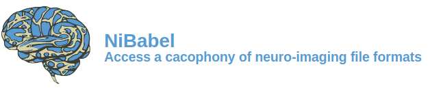

.. -*- rest -*-
.. vim:syntax=rst

.. Following contents should be copied from LONG_DESCRIPTION in NiBabel/info.py

Read and write access to common neuroimaging file formats, including: ANALYZE_ (plain, SPM99, SPM2 and later),
GIFTI_, NIfTI1_, NIfTI2_, `CIFTI-2`_, MINC1_, MINC2_, `AFNI BRIK/HEAD`_, ECAT_ and Philips PAR/REC
In addition, NiBabel also supports FreeSurfer_'s MGH_, geometry, annotation and morphometry files,
and provides some limited support for DICOM_.

NiBabel's API gives full or selective access to header information (metadata), and image
data is made available via NumPy arrays. For more information, see NiBabel's `documentation site`_
and `API reference`_.

.. _API reference: https://nipy.org/nibabel/api.html
.. _AFNI BRIK/HEAD: https://afni.nimh.nih.gov/pub/dist/src/README.attributes
.. _ANALYZE: http://www.grahamwideman.com/gw/brain/analyze/formatdoc.htm
.. _CIFTI-2: https://www.nitrc.org/projects/cifti/
.. _DICOM: http://medical.nema.org/
.. _documentation site: http://nipy.org/NiBabel
.. _ECAT: http://xmedcon.sourceforge.net/Docs/Ecat
.. _Freesurfer: https://surfer.nmr.mgh.harvard.edu
.. _GIFTI: https://www.nitrc.org/projects/gifti
.. _MGH: https://surfer.nmr.mgh.harvard.edu/fswiki/FsTutorial/MghFormat
.. _MINC1:
    https://en.wikibooks.org/wiki/MINC/Reference/MINC1_File_Format_Reference
.. _MINC2:
    https://en.wikibooks.org/wiki/MINC/Reference/MINC2.0_File_Format_Reference
.. _NIfTI1: http://nifti.nimh.nih.gov/nifti-1/
.. _NIfTI2: http://nifti.nimh.nih.gov/nifti-2/

.. list-table::
   :widths: 20 80
   :header-rows: 0

   * - Code
     -
      .. image:: https://img.shields.io/badge/code%20style-black-000000.svg
         :target: https://github.com/psf/black
         :alt: code style: black
      .. image:: https://img.shields.io/badge/%20imports-isort-%231674b1?style=flat&labelColor=ef8336
         :target: https://pycqa.github.io/isort/
         :alt: imports: isort
      .. image:: https://img.shields.io/badge/pre--commit-enabled-brightgreen?logo=pre-commit&logoColor=white
         :target: https://github.com/pre-commit/pre-commit
         :alt: pre-commit
      .. image:: https://codecov.io/gh/nipy/NiBabel/branch/master/graph/badge.svg
         :target: https://codecov.io/gh/nipy/NiBabel
         :alt: codecov badge
      .. image:: https://img.shields.io/librariesio/github/nipy/NiBabel
         :target: https://libraries.io/github/nipy/NiBabel
         :alt: Libraries.io dependency status for GitHub repo

   * - Status
     -
      .. image:: https://github.com/nipy/NiBabel/actions/workflows/stable.yml/badge.svg
         :target: https://github.com/nipy/NiBabel/actions/workflows/stable.yml
         :alt: stable tests
      .. image:: https://github.com/nipy/NiBabel/actions/workflows/pages/pages-build-deployment/badge.svg
         :target: https://github.com/nipy/NiBabel/actions/workflows/pages/pages-build-deployment
         :alt: documentation build

   * - Packaging
     -
      .. image:: https://img.shields.io/pypi/v/nibabel.svg
         :target: https://pypi.python.org/pypi/nibabel/
         :alt: PyPI version
      .. image:: https://img.shields.io/pypi/format/nibabel.svg
         :target: https://pypi.org/project/nibabel/
         :alt: PyPI Format
      .. image:: https://img.shields.io/pypi/pyversions/nibabel.svg
         :target: https://pypi.python.org/pypi/nibabel/
         :alt: PyPI - Python Version
      .. image:: https://img.shields.io/pypi/implementation/nibabel.svg
         :target: https://pypi.python.org/pypi/nibabel/
         :alt: PyPI - Implementation
      .. image:: https://img.shields.io/pypi/dm/nibabel.svg
         :target: https://pypistats.org/packages/nibabel/
         :alt: PyPI - Downloads

   * - Distribution
     -
      .. image:: https://repology.org/badge/version-for-repo/aur/python:nibabel.svg?header=Arch%20%28%41%55%52%29
         :target: https://repology.org/project/python:nibabel/versions
         :alt: Arch (AUR)
      .. image:: https://repology.org/badge/version-for-repo/debian_unstable/nibabel.svg?header=Debian%20Unstable
         :target: https://repology.org/project/nibabel/versions
         :alt: Debian Unstable package
      .. image:: https://repology.org/badge/version-for-repo/gentoo_ovl_science/nibabel.svg?header=Gentoo%20%28%3A%3Ascience%29
         :target: https://repology.org/project/nibabel/versions
         :alt: Gentoo (::science)
      .. image:: https://repology.org/badge/version-for-repo/nix_unstable/python:nibabel.svg?header=nixpkgs%20unstable
         :target: https://repology.org/project/python:nibabel/versions
         :alt: nixpkgs unstable
   * - License & DOI
     -
      .. image:: https://img.shields.io/pypi/l/nibabel.svg
         :target: https://github.com/nipy/nibabel/blob/master/COPYING
         :alt: License
      .. image:: https://zenodo.org/badge/DOI/10.5281/zenodo.591597.svg
         :target: https://doi.org/10.5281/zenodo.591597
         :alt: Zenodo DOI

Installation
============

To install NiBabel's `current release`_ with ``pip``, run::

   pip install nibabel

To install the latest development version, run::

   pip install git+https://github.com/nipy/nibabel

For more information on previous releases, see the `release archive`_.

.. _current release: https://pypi.python.org/pypi/NiBabel
.. _release archive: https://github.com/nipy/NiBabel/releases

Mailing List
============

Please send any questions or suggestions to the `neuroimaging mailing list
<https://mail.python.org/mailman/listinfo/neuroimaging>`_.

License
=======

NiBabel is licensed under the terms of the `MIT license`_. Some code included
with NiBabel is licensed under the `BSD license`_. For more information,
please see the COPYING_ file.

.. _BSD license: https://opensource.org/licenses/BSD-3-Clause
.. _COPYING: https://github.com/nipy/nibabel/blob/master/COPYING
.. _MIT license: https://github.com/nipy/nibabel/blob/master/COPYING#nibabel

Citation
========

Recent NiBabel releases have a Zenodo_ `Digital Object Identifier`_ (DOI) badge at
the top of the release notes. Click on the badge for more information.

.. _Digital Object Identifier: https://en.wikipedia.org/wiki/Digital_object_identifier
.. _zenodo: https://zenodo.org
